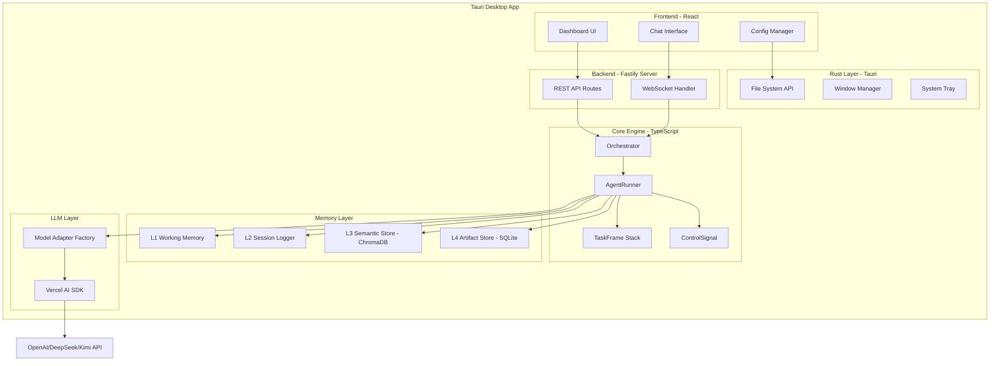
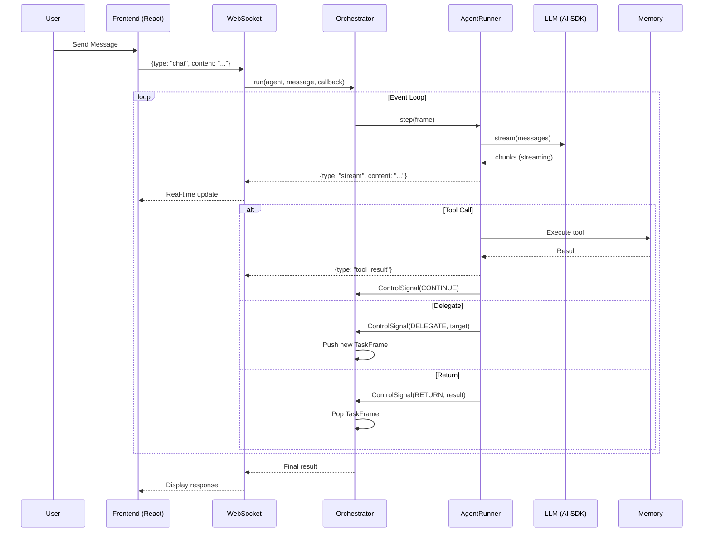

## 产品概述

将 Python 多智能体协作平台 SoloQueue 改造为全栈 TypeScript 桌面端应用，保留核心功能：递归式 Agent 编排、4 层记忆系统、Markdown 配置驱动、WebSocket 实时交互。

## 核心功能

- **多 Agent 编排**: Leader 通过 delegate_to/delegate_parallel 向子 Agent 委派任务，支持串行和并行
- **递归调用栈**: Orchestrator 维护 TaskFrame 栈，支持嵌套委派和结果返回
- **信号驱动事件循环**: AgentRunner.step() 返回 ControlSignal，驱动下一步操作
- **4 层记忆系统**: L1-工作记忆 / L2-会话日志 / L3-语义检索(ChromaDB) / L4-制品存储
- **文件驱动配置**: Markdown + YAML Frontmatter 定义 Agent、团队、技能
- **LLM 多模型适配**: 支持 OpenAI/DeepSeek/Kimi，流式输出
- **上下文预算管理**: Token 计数 + 优先级截断，防止超出模型限制
- **安全审批机制**: 危险操作需用户确认，支持 WebUI 审批通道
- **桌面端 GUI**: 现代化 React 界面，实时显示 Agent 思考过程和工具调用

## 技术栈

| 层级 | 技术 | 版本 | 说明 |
| --- | --- | --- | --- |
| **桌面框架** | Tauri | v2.10.3 | 轻量跨平台桌面应用 |
| **前端框架** | React | 19.2.4 | UI 组件化开发 |
| **后端框架** | Fastify | 5.8.2 | 高性能 HTTP/WebSocket 服务 |
| **LLM SDK** | Vercel AI SDK | 5.0.52 | 统一的 LLM 调用接口 |
| **OpenAI SDK** | openai | 6.33.0 | 官方 TypeScript 客户端 |
| **向量数据库** | ChromaDB | 3.3.1 | 语义记忆存储 |
| **本地数据库** | better-sqlite3 | 11.x | 制品存储 (L4) |
| **类型验证** | Zod | 4.3.6 | 配置 Schema 验证 |
| **CSS 框架** | TailwindCSS | v4.0 | 原子化 CSS |
| **UI 组件** | shadcn/ui | latest | 可定制组件库 |
| **构建工具** | Vite | 6.x | 快速构建 |
| **运行时** | Node.js | 24.x | 服务端运行环境 |


## 架构设计

### 系统架构图



### 核心模块对照表

| Python 模块 | TypeScript 模块 | 关键改动 |
| --- | --- | --- |
| `orchestration/orchestrator.py` | `core/orchestration/orchestrator.ts` | 改用 async/await，保留栈结构 |
| `orchestration/runner.py` | `core/orchestration/runner.ts` | 使用 Vercel AI SDK 流式调用 |
| `orchestration/frame.py` | `core/orchestration/frame.ts` | 类型定义改用 Zod |
| `orchestration/signals.py` | `core/orchestration/signals.ts` | 枚举 + 类型定义 |
| `core/adapters/` | `core/llm/adapters/` | 使用 Vercel AI SDK Provider |
| `core/memory/` | `core/memory/` | ChromaDB JS + better-sqlite3 |
| `core/context/` | `core/context/` | 使用 tiktoken WASM |
| `core/loaders/` | `core/loaders/` | 使用 gray-matter 解析 YAML |
| `core/registry.py` | `core/registry/` | 单例模式保留 |
| `web/app.py` | `server/app.ts` | Fastify 替代 FastAPI |


### 数据流



## 目录结构

```text
soloqueue-ts/
├── src/                           # React 前端
│   ├── components/
│   │   ├── ui/                   # shadcn/ui 组件
│   │   ├── chat/                 # 聊天界面组件
│   │   ├── agent/                # Agent 可视化组件
│   │   └── config/               # 配置管理组件
│   ├── hooks/                    # 自定义 Hooks
│   ├── lib/                      # 工具函数
│   ├── stores/                   # Zustand 状态管理
│   ├── types/                    # TypeScript 类型
│   └── App.tsx
│
├── server/                        # Fastify 后端
│   ├── index.ts                  # 入口
│   ├── app.ts                    # Fastify 应用
│   ├── routes/
│   │   ├── agents.ts            # Agent CRUD
│   │   ├── groups.ts            # Group CRUD
│   │   ├── skills.ts            # Skill CRUD
│   │   └── artifacts.ts         # Artifact API
│   ├── websocket/
│   │   ├── chat.ts              # 聊天 WebSocket
│   │   └── approval.ts          # 审批 WebSocket
│   └── plugins/
│       ├── cors.ts
│       └── websocket.ts
│
├── core/                          # 核心引擎
│   ├── orchestration/
│   │   ├── orchestrator.ts      # [NEW] 核心编排器
│   │   ├── runner.ts            # [NEW] Agent 执行器
│   │   ├── frame.ts             # [NEW] TaskFrame 定义
│   │   ├── signals.ts           # [NEW] 控制信号
│   │   └── tools.ts             # [NEW] 工具解析
│   ├── llm/
│   │   ├── adapters/
│   │   │   ├── base.ts          # [NEW] 适配器基类
│   │   │   ├── openai.ts        # [NEW] OpenAI 适配器
│   │   │   ├── deepseek.ts      # [NEW] DeepSeek 适配器
│   │   │   └── kimi.ts          # [NEW] Kimi 适配器
│   │   ├── factory.ts           # [NEW] 适配器工厂
│   │   └── tools.ts             # [NEW] 工具绑定
│   ├── memory/
│   │   ├── manager.ts           # [NEW] 内存管理器
│   │   ├── semantic-store.ts    # [NEW] ChromaDB 存储 (L3)
│   │   ├── artifact-store.ts    # [NEW] SQLite 存储 (L4)
│   │   ├── session-logger.ts    # [NEW] 会话日志 (L2)
│   │   └── user-memory.ts       # [NEW] 用户画像
│   ├── context/
│   │   ├── token-counter.ts     # [NEW] Token 计数
│   │   └── builder.ts           # [NEW] 上下文构建
│   ├── loaders/
│   │   ├── agent-loader.ts      # [NEW] Agent 配置加载
│   │   ├── group-loader.ts      # [NEW] Group 配置加载
│   │   ├── skill-loader.ts      # [NEW] Skill 配置加载
│   │   └── schema.ts            # [NEW] Zod Schema 定义
│   ├── registry/
│   │   └── index.ts             # [NEW] 全局注册表
│   ├── primitives/              # [NEW] 内置工具
│   │   ├── bash.ts
│   │   ├── read-file.ts
│   │   ├── write-file.ts
│   │   ├── grep.ts
│   │   ├── glob.ts
│   │   └── web-fetch.ts
│   ├── security/
│   │   └── approval.ts          # [NEW] 安全审批
│   └── config.ts                # [NEW] 配置管理
│
├── src-tauri/                     # Tauri Rust 层
│   ├── src/
│   │   ├── main.rs              # 主入口
│   │   └── commands.rs          # Tauri 命令
│   ├── Cargo.toml
│   └── tauri.conf.json
│
├── config/                        # 配置文件 (保留原有格式)
│   ├── agents/
│   ├── groups/
│   └── skills/
│
├── package.json
├── tsconfig.json
├── vite.config.ts
└── tailwind.config.ts
```

## 核心代码结构

### 1. 控制信号与 TaskFrame

```typescript
// core/orchestration/signals.ts
export enum SignalType {
  CONTINUE = 'CONTINUE',
  DELEGATE = 'DELEGATE',
  DELEGATE_PARALLEL = 'DELEGATE_PARALLEL',
  RETURN = 'RETURN',
  ERROR = 'ERROR',
  USE_SKILL = 'USE_SKILL',
}

export interface ParallelDelegateTarget {
  targetAgent: string;
  instruction: string;
  toolCallId: string;
}

export interface ControlSignal {
  type: SignalType;
  targetAgent?: string;
  instruction?: string;
  toolCallId?: string;
  skillName?: string;
  skillArgs?: string;
  result?: string;
  errorMsg?: string;
  parallelDelegates?: ParallelDelegateTarget[];
}

// core/orchestration/frame.ts
import type { CoreMessage } from 'ai';

export interface TaskFrame {
  agentName: string;
  memory: CoreMessage[];
  state: Record<string, unknown>;
  instruction: string;
  parentToolCallId?: string;
  result?: string;
  dynamicConfig?: AgentSchema;
}
```

### 2. Agent Schema (Zod)

```typescript
// core/loaders/schema.ts
import { z } from 'zod';

export const AgentSchema = z.object({
  name: z.string(),
  description: z.string(),
  model: z.string().optional(),
  reasoning: z.boolean().default(false),
  group: z.string().optional(),
  isLeader: z.boolean().default(false),
  tools: z.array(z.string()).default([]),
  skills: z.array(z.string()).default([]),
  subAgents: z.array(z.string()).default([]),
  memory: z.string().optional(),
  color: z.string().optional(),
  systemPrompt: z.string().optional(),
});

export type AgentConfig = z.infer<typeof AgentSchema>;

export const GroupSchema = z.object({
  name: z.string(),
  description: z.string(),
  sharedContext: z.string().optional(),
});

export const SkillSchema = z.object({
  name: z.string(),
  description: z.string(),
  allowedTools: z.array(z.string()).default([]),
  disableModelInvocation: z.boolean().default(false),
  subagent: z.string().optional(),
  arguments: z.string().optional(),
  content: z.string().optional(),
});
```

### 3. Orchestrator 核心接口

```typescript
// core/orchestration/orchestrator.ts
export class Orchestrator {
  private stack: TaskFrame[] = [];
  private memoryManagers: Map<string, MemoryManager> = new Map();
  private sessionLogger: SessionLogger;
  
  constructor(
    private registry: Registry,
    private workspaceRoot: string
  ) {}

  async run(
    initialAgent: string,
    userMessage: string,
    options: {
      stepCallback?: (event: StreamEvent) => void;
      sessionId?: string;
      userId?: string;
    } = {}
  ): Promise<string> {
    // 主事件循环
  }

  private async executeFrame(
    frame: TaskFrame,
    sessionId?: string,
    stepCallback?: (event: StreamEvent) => void
  ): Promise<ControlSignal> {
    // 执行单个 Frame
  }

  private async runParallelDelegates(
    targets: ParallelDelegateTarget[],
    sessionId?: string,
    stepCallback?: (event: StreamEvent) => void
  ): Promise<Array<[AgentConfig, ParallelDelegateTarget, string]>> {
    // 并行执行子 Agent
  }
}
```

## 实现要点

### Vercel AI SDK 集成

```typescript
// core/llm/adapters/openai.ts
import { openai } from '@ai-sdk/openai';
import { streamText, generateText } from 'ai';

export class OpenAIAdapter {
  create(model: string, tools: Tool[]) {
    return {
      async *stream(messages: CoreMessage[]) {
        const result = streamText({
          model: openai(model),
          messages,
          tools: this.bindTools(tools),
        });
        
        for await (const chunk of result.textStream) {
          yield { content: chunk };
        }
      }
    };
  }
}
```

### ChromaDB 集成

```typescript
// core/memory/semantic-store.ts
import { ChromaClient, Collection } from 'chromadb';

export class SemanticStore {
  private collection: Collection;
  
  async addEntry(content: string, metadata: Record<string, unknown>, agentId?: string): Promise<string> {
    const embedding = await this.embedText(content);
    const id = `entry_${Date.now()}`;
    
    await this.collection.add({
      ids: [id],
      embeddings: [embedding],
      documents: [content],
      metadatas: [{ ...metadata, agentId, timestamp: new Date().toISOString() }],
    });
    
    return id;
  }
  
  async search(query: string, topK: number = 5): Promise<MemoryEntry[]> {
    const queryEmbedding = await this.embedText(query);
    const results = await this.collection.query({
      queryEmbeddings: [queryEmbedding],
      nResults: topK,
    });
    
    return this.parseResults(results);
  }
}
```

### Fastify WebSocket

```typescript
// server/websocket/chat.ts
import { FastifyInstance } from 'fastify';

export async function chatWebSocket(fastify: FastifyInstance) {
  fastify.register(import('@fastify/websocket'));
  
  fastify.get('/ws/chat', { websocket: true }, async (connection, req) => {
    const orchestrator = new Orchestrator(registry, workspaceRoot);
    
    connection.socket.on('message', async (raw) => {
      const data = JSON.parse(raw.toString());
      
      if (data.type === 'chat') {
        for await (const event of orchestrator.run(data.agent, data.content)) {
          connection.socket.send(JSON.stringify(event));
        }
      }
    });
    
    connection.socket.on('close', () => {
      orchestrator.cleanup();
    });
  });
}
```

## 性能考量

| 场景 | 优化策略 |
| --- | --- |
| LLM 流式输出 | 使用 Vercel AI SDK 原生流式，避免缓冲完整响应 |
| 并行委派 | 使用 Promise.all + Worker Threads (CPU 密集型) |
| Token 计数 | 使用 tiktoken WASM 版本，缓存计数结果 |
| ChromaDB 查询 | 批量嵌入 + 结果缓存 (LRU) |
| 大文件输出 | 2000+ 字符自动卸载到 L4 Artifact Store |
| WebSocket 背压 | 使用队列缓冲 + 节流发送 (50ms 间隔) |


## 错误处理

- LLM 调用失败：自动重试 1 次 + 错误日志
- 工具执行失败：返回错误消息给 Agent 处理
- 并行委派失败：单个失败不影响其他，记录错误
- WebSocket 断开：自动清理资源，保存会话状态

## 设计风格

采用现代暗色主题，融合 Glassmorphism 玻璃拟态和 Cyberpunk 元素，突出 AI/科技感。

## 页面规划

### 1. Dashboard 首页

- 顶部导航栏：Logo、搜索框、设置按钮
- 统计卡片：Teams/Agents/Skills 数量
- 最近会话列表
- 实时日志面板

### 2. Chat 聊天页

- 左侧：会话历史列表
- 中间：消息流区域
- Agent 思考气泡（可折叠显示 reasoning）
- 工具调用卡片（展开显示参数和结果）
- 并行委派可视化（多个 Agent 同时工作）
- 右侧：当前 Team 成员状态面板
- 底部：输入框 + 目标 Agent 选择

### 3. Team 详情页

- Team 信息卡片
- Agent 成员列表（可视化拓扑图）
- Shared Context 编辑器
- 快速发起对话按钮

### 4. Agent 详情页

- Agent 配置表单
- System Prompt 编辑器（Markdown 高亮）
- 可用工具列表
- Sub-Agents 关系图

### 5. Settings 设置页

- LLM 配置（API Key、Base URL、默认模型）
- Embedding 配置
- 安全审批设置
- 日志级别设置