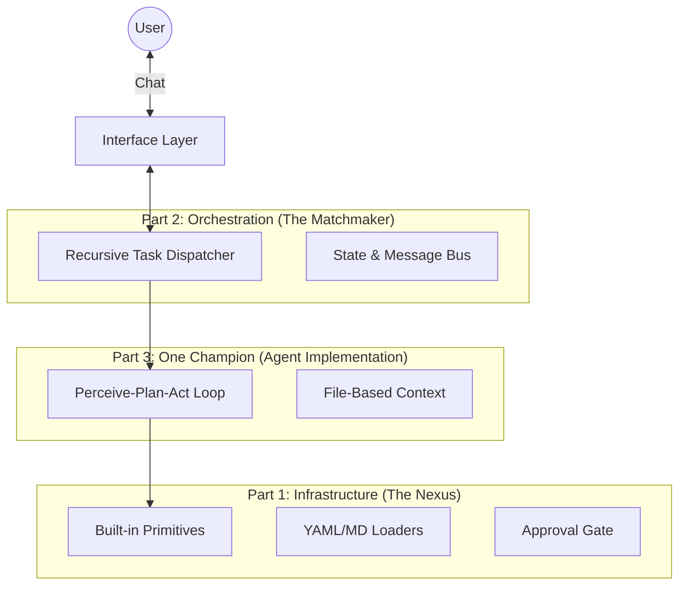

# Project Design Document: SoloQueue

**Version:** 4.0.0 (Master Plan)
**Status:** Approved
**Author:** Solo-preneur (SRE)
**Date:** 2026-02-05

---

## 1. Executive Summary

**SoloQueue** 是一个纯文件驱动的递归式 AI Agent 网络。系统架构遵循 **"SRE + Unix Philosophy"**，将复杂系统拆解为三个独立的支柱模块：基础设施、调度编排、个体实现。

**Key Features:**
*   **Database-free:** 纯文件系统作为 Source of Truth。
*   **Fractal Architecture:** 递归的 Agent -> Manager -> Worker 结构。
*   **Standardized:** 兼容 Claude Code / Gemini 的 Agent 与 Skill 定义。

---

## 2. System Architecture Overview



---

## 3. Part 1: Infrastructure (The Nexus)

> 🏗️ **Detailed Design:** See [doc/part1_infrastructure.md](./part1_infrastructure.md)

基础设施层提供 Agent 运行所需的物理法则。它不包含业务逻辑，只负责"能力的提供与限制"。

**Core Components:**
1.  **Built-in Primitives (Layer 1):**
    *   硬编码的原子操作：`bash`, `read_file`, `write_file`, `web_fetch`, `grep`, `glob`, `find`。
    *   这是系统与 OS 交互的唯一通过。
2.  **Loader System:**
    *   动态加载 `config/agents/*.md` (Agent配置)。
    *   动态加载 `skills/*/SKILL.md` (用户技能)。
3.  **Security Mechanism:**
    *   针对 `bash` 和 `write_file` 等危险操作的用户审批机制 (Approval Gate)。

---

## 4. Part 2: Orchestration (The Matchmaker)

> 🚧 **Detailed Design:** (Planning...)

调度层负责 Agent 之间的通信、任务流转与状态管理。我们采用 **LangGraph** 实现。

**Core Logic:**
1.  **Recursive Dispatching:**
    *   父 Agent 收到任务 -> 优先委派给 Sub-agents。
    *   Sub-agents 无法处理 -> 父 Agent 降级为 Worker 自行执行。
2.  **Communication Protocol:**
    *   **Phase 1:** 基于 `State` 的共享内存通信 (In-process)。
    *   **Phase 2:** 基于 ACP (Agent Communication Protocol) 的 RESTful 接口 (Distributed)。
3.  **Task Queue:**
    *   基于文件目录的任务信箱：`data/tasks/<agent_id>/pending/*.json`。

---

## 5. Part 3: Agent Implementation (The Champions)

> 🚧 **Detailed Design:** (Planning...)

这是单个 Agent 的"大脑"与"思考回路"。

**Core Logic:**
1.  **OODA Loop:**
    *   **Observe:** 读取 Memory 文件和 Input Task。
    *   **Orient:** 分析当前状态与目标差距。
    *   **Decide:** 选择调用哪个 Skill 或 Sub-agent。
    *   **Act:** 执行操作并等待反馈。
2.  **Configuration Format:**
    *   完全兼容 **Claude Code** 的 Sub-agent 定义格式 (Markdown + YAML Frontmatter)。
    *   **Role Inference:** 通过 `sub_agents` 和 `tools` 字段自动判断是 Manager 还是 Worker。
3.  **Skill System (Layer 2):**
    *   用户自定义的高阶技能（`skills/`），内部调用 Built-in Primitives。

---

## 6. Directory Structure

```text
soloQueue/
├── config/
│   └── agents/           # [Part 3] Agent Definitions
├── skills/               # [Part 3] Custom Skills
├── context/              # [Part 3] Agent Memory
├── src/
│   ├── core/
│   │   ├── primitives/   # [Part 1] Infrastructure
│   │   ├── loaders/      # [Part 1] Infrastructure
│   │   └── security/     # [Part 1] Infrastructure
│   ├── orchestration/    # [Part 2] Dispatcher / LangGraph
│   └── agent/            # [Part 3] Executor Loop
└── doc/
    ├── design.md         # Master Plan
    └── part1_infrastructure.md
```

---

## 7. Implementation Roadmap

1.  **Foundation (Part 1):** 搭建 Primitives, Loaders 和 Security。
2.  **The Loop (Part 3):** 实现单个 Agent 的思考循环。
3.  **The Grid (Part 2):** 实现多 Agent 间的递归调度。
4.  **Interface:** 对接飞书/CLI。