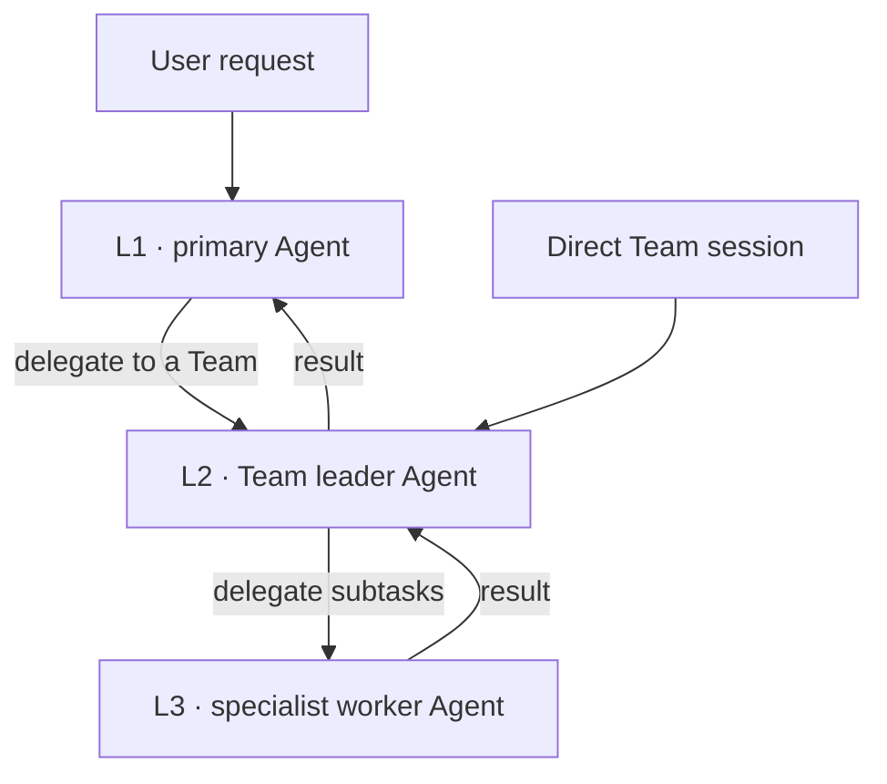
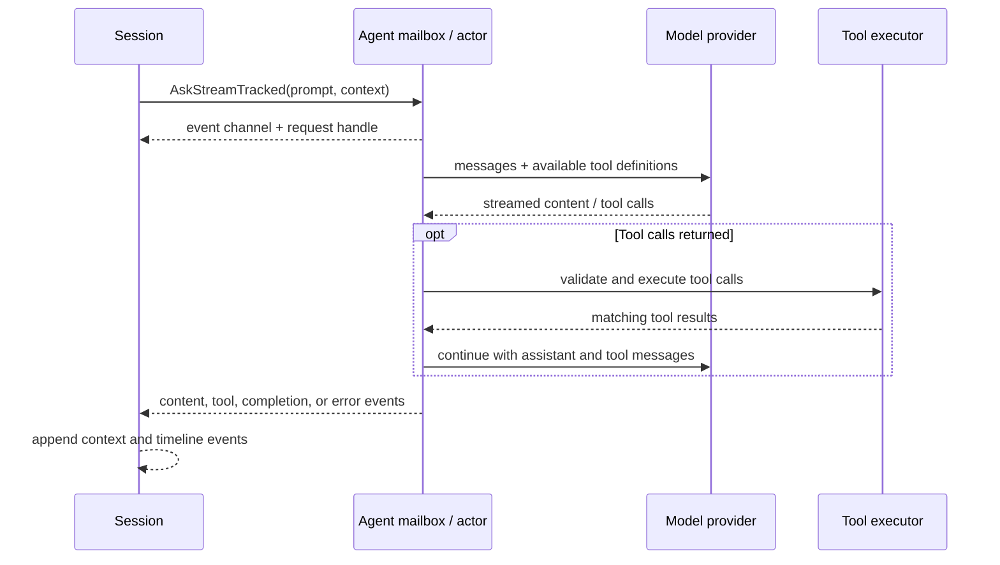

# Agent Execution

English | [简体中文](zh/agent.md)

This document follows one request from submission to streamed completion and explains how an Agent executes model turns, tools, and delegated work in the current code.

## Agent and Session responsibilities

An Agent is the execution unit for a configured prompt, model client, tool set, and working directory. A Session owns the conversation-level state around it: the active context window, request lifecycle, cancellation, route continuity, and timeline persistence. The Session submits work to an Agent; the Agent does not own the durable conversation history.

## Execution levels: L1, L2, and L3

These labels describe the execution hierarchy, not task difficulty and not the router's `general` / `engineering` / `research` categories. All three levels use the same Agent runtime; the factory gives them different prompts, tools, work contexts, and lifecycle owners.

| Level | Role in execution | Context and lifecycle |
| --- | --- | --- |
| **L1** | Primary Agent for the ordinary user session. It can answer and use tools directly, or delegate a suitable task to a Team leader. | Runs with the global SoloQueue work directory and the user's Session/context/timeline. Its delegate target validation is restricted to configured Team leaders. |
| **L2** | Team leader Agent created from a leader template. It handles work for that Team and can coordinate its specialist workers. A user can also open a dedicated Team session directly, without a preceding L1 delegation. | Uses the selected project/work directory, Team-specific prompt and tools, and a Session with its own context and timeline. Its durable-memory capability is bound to the Team. |
| **L3** | Specialist worker Agent created from a worker template or a dynamic worker definition to perform a subtask for L2. | Spawned or reused under the L2 Supervisor; inherits the L2 working directory. The Supervisor tracks and reaps worker instances. Workers do not receive the durable-memory tools. |

L1 can continue with direct execution or delegate to a configured Team leader. An L2 Supervisor wires worker delegation and tracks multiple child instances, including parallel instances of the same worker template. L2-to-worker delegation runs synchronously in the current factory path; the parent waits for the worker result before continuing. L3 does not form another delegation tier.

The levels are an execution topology, not mandatory hops for every request: direct L1 work stops at L1, and a user-started Team session begins at L2. Routing may independently select a model for each request; it does not promote a request from one level to another.

## Team organization

SoloQueue initially followed a familiar human-org pattern: splitting an engineering team into frontend, backend, and testing roles. In day-to-day use, this proved inefficient. A capable model already brings knowledge across these areas; creating an Agent for each job title can repeat role instructions and context, increase token use and handoffs, without a matching gain in capability.

The current approach organizes a Team around a broad domain. Its leader understands the task, decides whether to handle it directly or delegate, and combines the results. A small set of execution-focused workers handles bounded activities such as exploring a codebase, making focused edits, and testing. The built-in Engineering Team follows this pattern: one engineering leader supported by `explorer`, `editor`, and `tester` workers, rather than separate frontend, backend, and testing teams.

This is a practical trade-off, not a rule that every request must be delegated. The aim is to avoid duplicated role prompts and unnecessary coordination while retaining workers when they provide a concrete execution capability.

## Actor lifecycle and request ownership

Each Agent has a mailbox and a long-lived worker goroutine. Submitted jobs are processed serially by that Agent, and its runtime state moves through `Idle`, `Processing`, `Stopping`, and `Stopped`. A priority mailbox can prioritize continuation callbacks over ordinary user work.

`AskStreamTracked` creates a request-scoped job tracker and handle, adds trace/Agent metadata to the context, and enqueues the work. The caller receives a buffered event channel immediately. The Agent emits events while running and closes the stream when finished. A caller must keep draining the channel, or cancel the request before abandoning it, because a full channel applies backpressure rather than dropping events.

The Session associates the request with its own ID and cancellation lifecycle. This lets it cancel or fence the specific request without confusing it with a later mailbox job. A normal interactive browser disconnect does not necessarily cancel background work; cancellation ownership depends on the request origin and explicit cancellation path.

## Model and tool loop

For a Session-backed request, `AskStreamWithHistoryTracked` builds each provider payload from the current `ContextWindow`. The Agent converts the context-window representation to its LLM message type, applies the selected request-scoped model override, and calls the streaming model client. A direct Agent request without Session history instead uses a temporary in-memory strategy for that turn.

The stream loop handles incremental content, reasoning, and tool-call argument events. Once a tool call is complete, the Agent resolves it against the registered tool set, executes it, emits tool-start/tool-done events, and adds a tool result tied to the original call ID. The assistant tool-call message and corresponding results are then included in the next model iteration. If the model returns a final answer, the Agent emits completion; provider, tool, or cancellation failures are represented as error/terminal events.

Tool implementations are registered through the runtime's tool subsystem. This keeps model protocol handling in `internal/agent` while the concrete operations live under `internal/agenttools`. The Agent's execution context carries the request's selected model, telemetry, cancellation, and run-watch metadata.

## Delegated Agents

Delegation is implemented as a tool flow, not as a separate router model. The delegate tool resolves a named target, can reuse a suitable idle Agent in the same working directory, or asks the Session's Supervisor/Agent factory to create a child. Child Agents inherit the parent working directory. The Supervisor tracks children by template and instance so they can be inspected, stopped, unregistered, and reaped.

Some delegation runs asynchronously. In that case the parent Agent yields its current job while delegated work continues. The priority mailbox schedules the continuation callback ahead of ordinary new work so the parent can resume with the delegation result while preserving the order of context updates. Structured delegation-start/completion events are separate from ordinary text deltas.

The Agent package exposes a small set of event and location interfaces through `internal/iface`; Session and tool packages use those contracts rather than depending on each other's concrete internals.

## Event and persistence boundary

Agent events represent stream data and control transitions, including content deltas, reasoning deltas, tool start/completion, iteration completion, final response, error, and delegation lifecycle. The server maps these events to the WebSocket protocol. Session hooks append conversation messages and tool metadata to the timeline; system prompts are loaded into the context window but intentionally are not persisted as conversation events.

Useful code and tests: [`internal/agent`](../internal/agent), [`internal/session`](../internal/session), [`internal/agenttools`](../internal/agenttools), [`internal/iface`](../internal/iface), and [`internal/agent/stream_test.go`](../internal/agent/stream_test.go).
