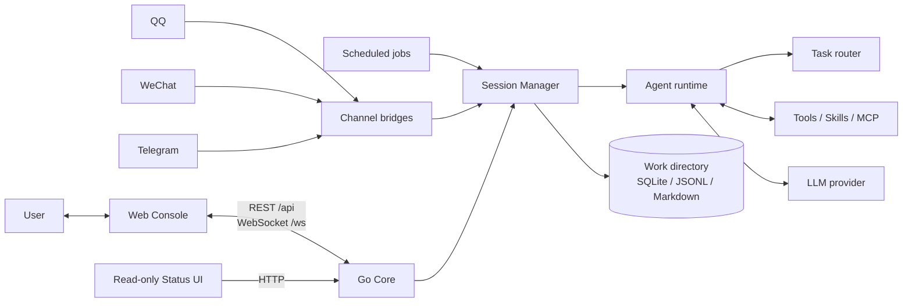
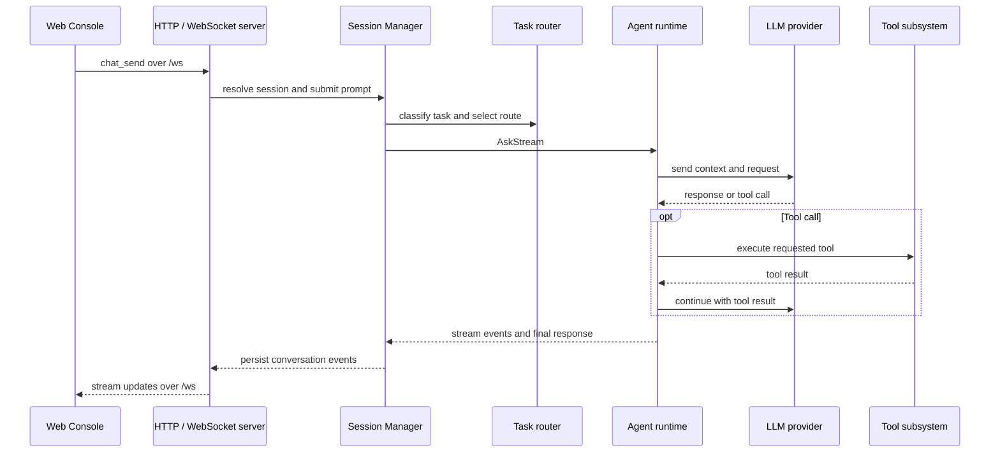

# Architecture

English | [简体中文](zh/architecture.md)

This document describes how SoloQueue runs, how its components interact, and where requests and data flow in the current implementation.

## System overview

SoloQueue has a Go **Core** that owns sessions, configuration, tools, and persistent data. The **Web Console** is the primary interactive interface; it can be bundled with Core or run separately and connect to a local or remote Core. The **Status UI** is a separate, read-only view. Messaging channels and scheduled jobs can also start work through Core.

The browser is a client, not the runtime: when a Web Console connects to a remote Core, requests and work-directory data belong to that Core. In the combined mode, Core serves the Web Console and Status UI from the same listener. A standalone Web Console serves only static frontend assets and connects directly to the configured backend.

## Running and connecting

| Mode | What runs | Typical use |
| --- | --- | --- |
| Combined | Core, Web Console, and Status UI | Use the complete local application from one address. |
| Core service | Core and API; optionally the read-only Status UI | Keep the runtime on a machine or server and connect a browser separately. |
| Standalone Web | Web Console only | Open a local frontend and set its backend connection to a local or remote Core in **Settings → Connection**. |

Core listens on `127.0.0.1` by default. A separately hosted Web Console communicates with the Core over HTTP REST (`/api`) and WebSocket (`/ws`); it does not require a reverse proxy to be part of the frontend process. Remote access must be deliberately configured and protected (see [Security boundary](#security-boundary)).

## A request through the system

The main interactive chat path is:

Other Web Console pages use REST endpoints for configuration, sessions, teams, scheduled jobs, and status data. QQ, WeChat, and Telegram adapters normalize inbound messages; scheduled jobs start work through the same session and agent runtime. They differ at the entry and delivery edges, while sharing the Core's execution path.

## Components and responsibilities

| Component | Responsibility |
| --- | --- |
| [`cmd/soloqueue/cli`](../cmd/soloqueue/cli) | Process entry points and startup wiring. |
| [`internal/runtime`](../internal/runtime) | Builds the shared dependency container (`Stack`), including clients, registries, databases, and reload watchers. |
| [`internal/server`](../internal/server) | REST API, WebSocket hub, static frontend serving, and HTTP boundary. |
| [`internal/session`](../internal/session) | Creates and manages sessions, context windows, timeline writers, and agent instances. |
| [`internal/agent`](../internal/agent) | Runs the agent loop, handles tool calls, and coordinates delegated agents. |
| [`internal/router`](../internal/router) and [`internal/llm`](../internal/llm) | Classifies task type, selects configured routes, and communicates with model providers. |
| [`internal/agenttools`](../internal/agenttools) | Native tools, Skills, MCP integrations, and language-server support. |
| [`internal/prompt`](../internal/prompt), [`internal/team/store`](../internal/team/store) | Builds prompts and loads/persists agent and group definitions. |
| [`internal/cron`](../internal/cron), [`internal/channel`](../internal/channel) | Starts scheduled work and connects external messaging platforms. |
| [`internal/memory`](../internal/memory), [`internal/infra`](../internal/infra) | Context and memory, timelines, shared database, logging, telemetry, and work-directory support. |

Detailed implementation notes: [Task routing](routing.md), [Agent execution](agent.md), and [Context and memory](context-and-memory.md).

`runtime.Build` assembles shared services once at startup. The resulting `runtime.Stack` is passed to session construction and the server so that browser requests, channel events, and scheduled tasks use the same configured runtime rather than creating separate copies of core services.

### Routing and agent execution

The router classifies work as `general`, `engineering`, or `research` and maps the result to configured model routes. Local pattern rules handle clear signals first; an LLM classifier is used when the result is ambiguous. Follow-up turns can retain the previous task level.

An Agent maintains the model/tool interaction loop. The model may return a response or request a tool; Core executes the tool, returns its result to the model, and streams progress back through the owning session. Native tools, Skills, and MCP-backed tools are exposed through the same tool execution boundary. The project or agent working directory provides execution context, but is not itself a security sandbox.

## Configuration and stored data

The Core's work directory defaults to `~/.soloqueue` and can be changed with `SOLOQUEUE_WORK_DIR`. When connecting a remote Web Console, configuration and persistent data remain on the Core host; browser connection preferences are local to that browser.

| Path | What it contains |
| --- | --- |
| `settings.yaml` | Core settings, model routes, and integration configuration. |
| `mcp.json` | External MCP server definitions. |
| `agents/`, `groups/` | Agent and group definitions used to build prompts and teams. |
| `skills/` | Globally installed Skills; a project may also provide compatible Skills under `.claude/skills/`. |
| `soloqueue.db` | Shared SQLite data used by runtime subsystems. |
| `logs/timelines/` | Append-only JSONL conversation and execution history, partitioned by team or session. |
| `memory/` | Markdown conversation summaries and related memory files. |

These stores have distinct roles: the context window is the active model input; summaries help carry information across compaction; long-term memory supports retrieval; and the timeline preserves replayable conversation events. They are not interchangeable backups. Protect the whole work directory and any project files the tools can access.

## Context and memory

- **Active context** (`internal/memory/ctxwin`) tracks tokens and compacts older history at configured thresholds. Before a request is sent to a provider, malformed orphaned tool-call/result pairs are filtered from the payload.
- **Conversation summaries** (`internal/memory/conversation`) preserve selected context across compaction as Markdown under the work directory.
- **Long-term retrieval** (`internal/memory/engine`) combines SQLite FTS5/BM25 search with a knowledge graph. Vector retrieval is optional and requires an embedding provider.
- **Timeline** (`internal/memory/timeline`) stores append-only JSONL events for conversation replay and execution history. System prompts are not written to the timeline.

## Integrations

- **Web:** REST for resources and settings; WebSocket for live chat and runtime events.
- **Channels:** QQ, WeChat, and Telegram adapters translate platform messages to Core sessions and deliver responses through platform-specific APIs.
- **Tools:** built-in tools run in the Core process; Skills provide packaged instructions and workflows; MCP connects configured external tool servers; LSP support is configured as an MCP integration.
- **Providers:** model routing and provider communication are handled by the router and LLM client layers.

## Security boundary

Core binds to loopback by default and does not provide application-level user authentication. Do not expose it directly to an untrusted network. For remote use, restrict access with a properly configured TLS/authenticating reverse proxy or an SSH tunnel, and connect the Web Console to that protected Core endpoint.

Tools execute with the operating-system permissions of the Core process. Selecting a project or working directory sets the tools' working context; it does **not** isolate filesystem or process access. Run Core with least privilege and only grant access to files and credentials it should be able to use.
