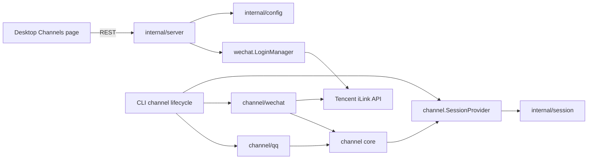
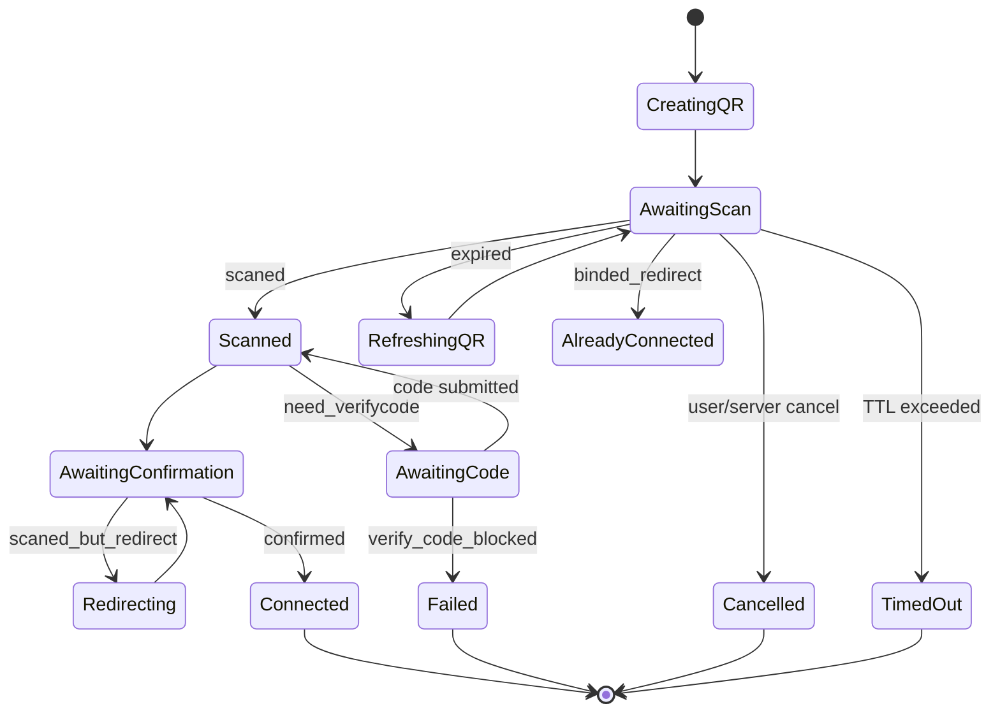

# Channel Refactor and WeChat Desktop Login Plan

Status: approved; implementation in progress  
Scope: package layout, QQ migration, WeChat naming, normalized inbound media, channel-specific text formatting, desktop configuration and QR login  
Out of scope: speech-to-text provider integration, outbound native voice/media upload, and proactive cron delivery

## 1. Decision summary

Adopt the following decisions:

1. Move the transport-neutral contracts and channel implementations under one namespace, but keep each implementation in its own Go package.
2. Use **WeChat** in product-facing names, routes, commands, configuration, and package paths.
3. Retain iLink/Weixin field names where they mirror Tencent's wire protocol.
4. Replace the dedicated QQ settings entry with a single **Channels** settings page containing QQ and WeChat sections.
5. Add a server-owned QR login state machine. The desktop starts and observes login through REST; credentials never pass through the renderer.
6. Preserve existing QQ behavior and support a one-release compatibility window for old Weixin configuration and API names.
7. Normalize inbound text and attachments at the channel boundary so transport details do not leak into sessions.
8. Format outbound text inside each channel implementation because QQ and WeChat support different Markdown subsets.

The target is a complete, testable channel foundation. The shared media contract describes inbound attachments; transport-specific CDN encryption, codecs, downloads, and uploads remain inside each implementation.

## 2. Goals and non-goals

### Goals

- A new channel can integrate without importing `qqbot`, `wechat`, or `session` protocol details.
- QQ behavior remains unchanged after moving packages.
- A user can connect, inspect, configure, reconnect, disable, and remove a WeChat account entirely from the desktop application.
- Multiple WeChat accounts remain isolated by channel, account, and L2 binding.
- Login survives ordinary UI navigation and is cancellable on timeout, account removal, config reload, or server shutdown.
- Authentication tokens are stored only by the backend and are never returned by read APIs.
- Old `weixin_bots` configuration can be loaded and migrated without losing credentials.

### Non-goals for this change

- Outbound WeChat image/file/video/voice CDN upload.
- A bundled speech-to-text engine. Media-only voice requires a separately configured audio-capable model or future ASR service.
- WeChat proactive cron delivery.
- A plugin runtime or dynamic channel loading system.
- A universal configuration schema for every future channel.
- Rewriting the QQ message bridge to the lowest common denominator.

## 3. Target package layout

```text
internal/channel/
├── message.go              # normalized inbound message and opaque reply token
├── session.go              # SessionProvider and result types
├── text_bridge.go          # shared text/slash-command bridge
├── binding.go              # L1/L2 binding value types, if needed by runtime
├── qq/
│   ├── api.go
│   ├── config.go
│   ├── gateway.go
│   ├── handler.go
│   ├── markdown.go
│   ├── ratelimit.go
│   ├── types.go
│   └── *_test.go
└── wechat/
    ├── api.go
    ├── config.go
    ├── gateway.go
    ├── login.go
    ├── login_manager.go
    ├── types.go
    └── *_test.go

cmd/soloqueue/cli/
├── channel.go              # shared SessionProvider construction
├── qq.go                   # QQ lifecycle manager
└── wechat.go               # WeChat lifecycle manager + CLI compatibility login
```

These are separate Go packages:

- `internal/channel`
- `internal/channel/qq`
- `internal/channel/wechat`

Do not put QQ and WeChat source files directly in `internal/channel`; doing so would create one large package with unrelated APIs, credentials, transports, and test fixtures.

## 4. Dependency boundaries



Allowed dependencies:

- `channel/qq` and `channel/wechat` may import `channel`.
- `session` may import `channel` to implement `SessionProvider`.
- `channel` must not import `qq`, `wechat`, `session`, `config`, or `server`.
- `config` may convert stored configuration to `qq.Config` or `wechat.Config`; alternatively conversion can live in the CLI assembly layer if a later cycle appears.
- `server` may depend on `wechat.LoginManager` through a narrow interface.

## 5. Core contracts

Keep the shared interface intentionally small:

```go
type Message struct {
    Channel        string
    AccountID      string
    ConversationID string
    UserID         string
    Text           string // typed text plus channel-provided transcripts
    Attachments    []Attachment
    ReplyToken     string // opaque transport correlation token
}

type Attachment struct {
    Kind       AttachmentKind // image, audio, video, file
    LocalPath  string         // populated after transport-specific processing
    MIMEType   string
    Name       string
    Transcript string
}

type TextSender interface {
    SendText(context.Context, Message, string) error
}

type TextFormatter interface {
    FormatText(string) string
}

type SessionProvider interface {
    AskStream(context.Context, string, OnIntermediateFunc) (*AskStreamResult, error)
    Clear(context.Context) error
    Compact(context.Context) error
    CancelCurrent(string) error
    SaveUploadedFile(context.Context, string, []byte) (string, error)
}
```

`ReplyToken` means:

- QQ: message/thread correlation when the QQ bridge chooses to use the common model.
- WeChat: inbound `context_token`, returned unchanged on every reply.
- Future channels: message ID, thread timestamp, reply key, or another opaque value.

QQ keeps its specialized bridge for passive replies, Markdown splitting, media uploads, and rate limiting. WeChat uses the shared text bridge, but its sender applies a WeChat-specific Markdown compatibility filter before creating a TEXT item. Common behavior should only move into `channel` when at least two implementations use the same semantics.

### Inbound voice handling

The channel core never downloads CDN objects, performs AES decryption, or decodes SILK. `channel/wechat` owns those wire-level operations:

1. When `voice_item.text` is present, use it as `Attachment.Transcript` and include it in `Message.Text`; downloading the audio is optional.
2. Without a transcript, download and decrypt the CDN object, transcode SILK to WAV when a codec is available, and populate an audio attachment.
3. The session adapter constructs model input. Until an audio-capable model or ASR provider is configured, a media-only voice receives an explicit unsupported response rather than being silently discarded.

The first implementation milestone supports the transcript fast path and normalized attachment contract. Encrypted CDN download and SILK conversion can be added behind the same contract without changing `channel.Message`.

### Outbound Markdown handling

iLink replies are TEXT items and WeChat clients render only a Markdown-compatible subset. Raw model Markdown must therefore pass through `wechat.MarkdownFormatter`. The formatter preserves compatible code blocks, inline code, bold text, tables, and separators, while removing or degrading unsupported constructs such as Markdown images, CJK italics, H5/H6 markers, and strikethrough markers. Images should be sent as media items rather than Markdown image links.

```text
Agent Markdown -> QQ formatter / WeChat formatter / plain formatter -> channel API
```

The core bridge does not normalize Markdown because doing so would discard capabilities available in richer channels.

## 6. Naming and compatibility migration

### Canonical names

| Layer | Canonical name |
| --- | --- |
| Product label | WeChat |
| Go package | `internal/channel/wechat` |
| CLI | `soloqueue wechat ...` |
| YAML | `wechat_bots` |
| Settings JSON | `wechatBots` |
| REST config | `/api/config/wechat-bots/` |
| REST operations | `/api/channels/wechat/...` |
| Logs | `wechat-*` |
| Session prefix | `wechat-<accountID>` |

Wire protocol names such as `WeixinMessage`, `ilink_bot_id`, `ilink_user_id`, `X-WECHAT-UIN`, and Tencent endpoint paths remain unchanged.

### One-release compatibility window

- Read both `wechat_bots` and legacy `weixin_bots` from YAML.
- If only the legacy field exists, map it to `WechatBots` in memory.
- On the next successful settings save, write only `wechat_bots`.
- Keep `/api/config/weixin-bots/` as a deprecated alias that calls the canonical handlers.
- Keep `soloqueue weixin login` as a hidden/deprecated alias for `soloqueue wechat login`.
- Log one warning when a legacy name is loaded; never log credentials.
- Remove aliases only in a later breaking release.

Because YAML aliases are not naturally expressed by two tags on one field, implement compatibility with a custom `UnmarshalYAML` helper or a temporary raw settings struct. Do not keep two mutable slices in `Settings`.

## 7. Configuration model and secret handling

Canonical backend configuration:

```yaml
wechat_bots:
  - id: personal
    name: Personal WeChat
    enabled: true
    bot_token: <secret>
    bot_id: <iLink bot id>
    base_url: https://ilinkai.weixin.qq.com
    bot_agent: SoloQueue/0.1.0
    bind_type: l1
    bind_agent: ""
    whitelist_enabled: false
    whitelist: []
```

The persisted Go type can contain `BotToken`, but public read responses must use a redacted DTO:

```json
{
  "id": "personal",
  "name": "Personal WeChat",
  "enabled": true,
  "connected": true,
  "credentialConfigured": true,
  "botIdMasked": "e06c…im.bot",
  "bind_type": "l1",
  "bind_agent": "",
  "whitelist_enabled": false,
  "whitelist": []
}
```

Rules:

- `GET` never returns `bot_token`.
- General `PUT` never accepts or clears `bot_token`.
- Only successful QR login writes credentials.
- Disconnect/remove requires a dedicated endpoint and confirmation.
- Logs redact QR identifiers, tokens, context tokens, and full user IDs where practical.
- `settings.yaml` remains sensitive and should be created with mode `0600`. If the current loader cannot guarantee this, include a loader permission hardening change in this phase.

## 8. Backend QR login design

### Why a LoginManager

Tencent QR login is a multi-minute state machine with long polling, optional redirects, optional verification codes, refresh, timeout, and cancellation. It must outlive a single browser request but must not become an unbounded background goroutine.

`wechat.LoginManager` owns active sessions:

```go
type LoginManager struct {
    mu       sync.RWMutex
    sessions map[string]*LoginSession
    client   LoginClient
    store    CredentialStore
    onSaved  func() error // reload channel managers
}
```

Each `LoginSession` contains:

- random session ID
- desired local account ID/name/binding options
- QR payload and expiry
- current status and user-facing status code
- current Tencent polling base URL
- pending verification-code channel
- context cancel function
- timestamps and last sanitized error

The manager supports `Start`, `Snapshot`, `SubmitVerificationCode`, `Cancel`, and `Close`.

### State machine



Implementation rules:

- Maximum active login sessions: 5 globally and 1 per local account ID.
- Default TTL: 8 minutes; completed sessions retained for 2 minutes for final UI reads.
- Maximum automatic QR refreshes: 3, matching current upstream behavior.
- Poll requests use the Tencent-recommended timeout plus a small client margin.
- Every terminal state cancels in-flight HTTP work.
- Server shutdown calls `LoginManager.Close()`.
- Config reload must not cancel an unrelated active login; account removal must cancel a login for that account.
- On `confirmed`, validate `bot_token` and `ilink_bot_id`, persist atomically, then hot-reload WeChat gateways.
- If persistence succeeds but reload fails, report `connected_with_warning`; credentials remain saved and the UI offers “Retry start”.

## 9. REST API contract

All endpoints use the existing server authentication middleware.

### Configuration

```text
GET    /api/config/wechat-bots/
PUT    /api/config/wechat-bots/
DELETE /api/config/wechat-bots/{accountID}
```

`PUT` updates non-secret settings only. `DELETE` cancels the gateway, removes credentials, and requires a body confirmation:

```json
{ "confirmAccountId": "personal" }
```

### Login

Start:

```http
POST /api/channels/wechat/login
```

```json
{
  "accountId": "personal",
  "name": "Personal WeChat",
  "bindType": "l1",
  "bindAgent": ""
}
```

```json
{
  "sessionId": "...",
  "status": "awaiting_scan",
  "qrPayload": "...",
  "expiresAt": "2026-07-17T12:00:00+08:00"
}
```

Observe:

```http
GET /api/channels/wechat/login/{sessionID}
```

```json
{
  "sessionId": "...",
  "status": "awaiting_confirmation",
  "expiresAt": "...",
  "message": "已扫码，请在手机微信中确认"
}
```

Submit code:

```http
POST /api/channels/wechat/login/{sessionID}/verification
```

```json
{ "code": "123456" }
```

Cancel:

```http
DELETE /api/channels/wechat/login/{sessionID}
```

Status is a stable machine code; `message` is optional display text. The desktop translates known status codes locally and only uses sanitized server text for unknown errors.

Recommended HTTP errors:

| Condition | Status |
| --- | --- |
| Invalid account/binding input | 400 |
| Session not found/expired | 404 |
| Login already active for account | 409 |
| Active-session capacity reached | 429 |
| Config service unavailable | 503 |
| Tencent failure before a session can start | 502 |

## 10. Desktop information architecture

### User and primary goal

User: a SoloQueue operator configuring messaging access on their own machine.  
Primary goal: connect a messaging account to an agent and verify that the channel is running.

### Navigation

- Rename sidebar item from **QQ Bot** to **Channels / 消息渠道**.
- Rename route from `/settings/qqbot` to `/settings/channels`.
- Keep `/settings/qqbot` as a redirect for one release.
- One page contains channel sections/cards for QQ and WeChat.

### Page hierarchy

P0:

- channel connection state
- account display name
- primary connect/reconnect action
- enabled state and agent binding summary

P1:

- whitelist status
- account identifier (masked where appropriate)
- last connection error with retry
- edit and disconnect actions

P2, under “Advanced”:

- QQ intents and sandbox mode
- WeChat base URL and bot-agent observability string
- raw whitelist editor

Do not display WeChat token fields.

### Component tree

```text
ChannelsTab
├── ChannelPageHeader
├── QQChannelSection
│   └── QQAccountCard[]
├── WeChatChannelSection
│   ├── WeChatEmptyState
│   ├── WeChatAccountCard[]
│   └── WeChatLoginDialog
│       ├── AccountBindingStep
│       ├── QRCodeStep
│       ├── VerificationCodeStep
│       └── LoginResultStep
└── DisconnectAccountDialog
```

Reuse shared controls for name, L1/L2 binding, agent selection, enabled state, and whitelist. Keep QQ credentials and WeChat authentication as channel-specific components.

### Happy path

1. Open Settings → Channels.
2. Click “Connect WeChat”.
3. Accept defaults (`name=WeChat`, `binding=L1`) or choose an L2 agent.
4. Click “Generate QR code”.
5. Scan and confirm on the phone.
6. Dialog transitions automatically to success.
7. Account card appears as connected and enabled.

This is three desktop actions before scanning: open page, connect, generate. If binding defaults can be committed before login, “Connect WeChat” may generate immediately and move binding controls into an optional first-screen disclosure, reducing it to two actions.

### QR rendering

Add the maintained `qrcode` JavaScript package and render `qrPayload` locally to canvas or SVG. This avoids loading a third-party QR image and keeps the short-lived payload within the local desktop renderer/backend boundary.

Requirements:

- 240–280 px QR code with a quiet zone.
- High-contrast light background independent of application theme.
- Countdown and “Refresh QR” action.
- Copy/open fallback only if Tencent provides a valid URL.
- Never log `qrPayload` in renderer console.

### View states

Empty:

- QQ: existing add-bot action.
- WeChat: explanation plus one “Connect WeChat” primary action.

Loading:

- account-card skeletons during initial config load.
- button spinner during QR creation.
- QR frame placeholder while canvas is rendering.

Error:

- human-readable reason, retry action, and preserved name/binding input.
- network loss pauses observation and retries with bounded backoff; it does not silently create another login.

Destructive:

- “Disconnect and remove” confirmation names the account and explains that a new QR scan is required.
- Disabling is reversible and requires no confirmation.

Accessibility and resilience:

- All steps usable by keyboard.
- Focus moves to the dialog heading, then QR status, then verification input when required.
- Status changes use an `aria-live="polite"` region.
- Do not encode state only through color.
- At 320 px width, channel cards become one column and QR remains within the viewport.
- At 200% text size, advanced controls stack instead of truncating.

Trade-off: no bulk account editing in this phase. Account connect/disconnect is infrequent, and optimizing the first-account experience is more valuable.

## 11. Frontend data model

Add types separate from persisted secret-bearing backend types:

```ts
interface WeChatAccountView {
  id: string
  name: string
  enabled: boolean
  connected: boolean
  credentialConfigured: boolean
  botIdMasked?: string
  bind_type: 'l1' | 'l2'
  bind_agent?: string
  whitelist_enabled: boolean
  whitelist: string[]
  lastError?: string
}

type WeChatLoginStatus =
  | 'creating_qr'
  | 'awaiting_scan'
  | 'scanned'
  | 'awaiting_confirmation'
  | 'awaiting_verification'
  | 'refreshing_qr'
  | 'connected'
  | 'connected_with_warning'
  | 'already_connected'
  | 'expired'
  | 'cancelled'
  | 'failed'
```

Use a component-local login reducer or a small dedicated hook, not a global Zustand store. Login state only matters while the Channels page/dialog is mounted; the backend remains the source of truth if the dialog remounts.

Observation strategy:

- Poll `GET login/{id}` every 1 second while state is active.
- After transport errors, back off to 2, 4, then 5 seconds.
- Stop on a terminal state or component unmount.
- On unmount, do not automatically cancel; navigation should not destroy an active scan. When returning, the page can query active login by account or retain the session ID in `sessionStorage`.
- Explicit dialog cancel calls the DELETE endpoint.

Do not extend the shared chat WebSocket in this phase. REST polling is simpler, bounded, independently retryable, and does not couple QR login to chat connection lifecycle.

## 12. Runtime lifecycle

Introduce a small CLI-level coordinator rather than a plugin framework:

```go
type ChannelManager interface {
    Reload()
    Shutdown()
}

type ChannelManagers []ChannelManager
```

`ServeCmd` constructs QQ and WeChat managers, then calls coordinator methods on config change and shutdown. Each implementation remains responsible for its protocol resources.

WeChat reload ordering:

1. Build and validate the next account set.
2. Cancel old account long polls.
3. Wait for cancellation with a short bounded timeout.
4. Start one gateway per enabled, credentialed account.
5. Publish sanitized status for the desktop.

Avoid holding the manager mutex while a network goroutine exits. Swap references under lock, then stop old gateways outside the lock.

## 13. File-level implementation plan

### Phase A — package, message contract, and naming migration

- Move `internal/qqbot/*` to `internal/channel/qq/*`.
- Move `internal/weixin/*` to `internal/channel/wechat/*`.
- Rename public Weixin configuration and CLI symbols to WeChat.
- Update imports in config, session, CLI, tests, and docs.
- Add legacy config/API/CLI aliases.
- Add channel manager coordinator.
- Add normalized attachments and WeChat voice-transcript tests.
- Add the WeChat Markdown compatibility formatter and behavior tests.

Verification:

- `go test ./...`
- QQ gateway and bridge tests unchanged except imports.
- Loading a legacy YAML fixture produces the canonical in-memory structure.
- Saving the migrated fixture emits only `wechat_bots`.

### Phase B — backend login manager and safe APIs

- Split current login HTTP calls from CLI prompting into a `LoginClient` interface.
- Implement `LoginManager`, bounded sessions, cancellation, expiry, redirect, verification, refresh, and persistence callbacks.
- Add sanitized config DTOs and dedicated remove endpoint.
- Register login routes in `internal/server`.
- Wire manager creation and shutdown in `ServeCmd`/`Mux` options.
- Keep CLI login implemented on the same manager/client primitives where practical.

Verification:

- deterministic fake-client state-machine tests for every Tencent state
- concurrent start/cancel/race tests
- handler tests for 400/404/409/429/502 and token redaction
- `go test -race ./internal/channel/wechat ./internal/server`

### Phase C — Channels desktop page

- Rename route/sidebar/i18n from QQ Bot to Channels.
- Extract shared binding and whitelist controls from `QQBotSection`.
- Add WeChat account cards and login dialog.
- Add `qrcode` with `pnpm`; update lockfile.
- Add API functions, types, login observation hook, and session-storage resume.
- Add Chinese and English strings.

Verification:

- component tests for empty/loading/error/success/destructive states
- fake-timer tests for polling/backoff and cleanup
- QR payload is rendered but absent from console/snapshots
- `pnpm test`, `pnpm lint`, and `pnpm build`

### Phase D — integration and documentation

- End-to-end test against a fake iLink HTTP server.
- Manual real-account scan on macOS desktop.
- Verify config hot reload starts exactly one long poll.
- Verify disable/re-enable, restart, reconnect, remove, legacy migration, L1, and L2 flows.
- Update architecture, configuration, and operator docs.

Verification:

- full Go and desktop test suites
- manual acceptance checklist signed off
- no token or QR payload in logs, REST reads, WebSocket events, or renderer storage

## 14. Test matrix

| Area | Cases |
| --- | --- |
| Core channel | reply token preserved; whitelist enabled-empty denies all; busy/cancel/error mapping |
| QQ regression | all existing gateway, markdown, rate-limit, media, and bridge tests |
| Login protocol | wait; scanned; confirm; redirect; verification; wrong verification; expiry refresh; already bound; timeout; cancel |
| Login concurrency | duplicate account; max sessions; simultaneous cancel/confirm; server shutdown |
| Credential safety | GET redaction; PUT cannot overwrite token; logs redact; delete removes token |
| Config migration | old only; new only; both present; save canonical; malformed entry |
| Runtime | reload starts one gateway; disabled starts none; missing credential starts none; bounded shutdown |
| Desktop | empty/loading/error; QR render; countdown; code entry; navigation resume; retry; disconnect confirmation |
| Accessibility | keyboard flow; focus transitions; aria-live status; 200% text; narrow layout |

When both old and new configuration fields exist, canonical `wechat_bots` wins and a warning is emitted. This precedence must be covered by a test.

## 15. Rollout and rollback

Rollout order:

1. Merge package moves and compatibility readers without changing the visible route.
2. Merge backend login APIs and redacted DTOs.
3. Merge Channels desktop page and route redirect.
4. Perform real-account validation.
5. Announce legacy aliases as deprecated.

Rollback properties:

- Phase A keeps old config readable.
- Desktop changes only consume new APIs after backend support exists.
- A failed gateway reload does not delete saved credentials.
- The CLI login alias remains available if the desktop flow has a regression.
- Package moves can be reverted independently from persisted configuration because wire formats remain compatible.

## 16. Risks and mitigations

| Risk | Impact | Mitigation |
| --- | --- | --- |
| Tencent changes undocumented QR states | login stalls | unknown-state timeout, sanitized diagnostics, protocol fixture tests |
| Duplicate long poll after reload | duplicate messages | cancel-and-wait before start; one gateway per account invariant |
| Token leaks through generic config API | account compromise | redacted DTO and dedicated credential write path |
| Renderer navigation loses login | confusing UX | backend-owned session plus sessionStorage resume |
| QR expires during scan | failed onboarding | countdown and bounded automatic refresh |
| Package move causes broad regression | QQ outage | move first, preserve behavior, run existing tests unchanged |
| Over-generalized channel interface | future implementations constrained | keep only proven shared text/session contracts |
| Legacy and canonical config diverge | wrong account starts | single canonical in-memory field and explicit precedence |

## 17. Acceptance criteria

The work is complete when all of the following are true:

- Source is organized under `internal/channel`, `internal/channel/qq`, and `internal/channel/wechat`.
- No non-QQ package imports `channel/qq` merely to access shared session types.
- Product-facing UI and commands say WeChat; iLink wire names remain accurate.
- Existing QQ text, Markdown, attachment, active/passive reply, whitelist, L1, and L2 tests pass.
- A first-time desktop user can connect WeChat without using the terminal or seeing a token.
- QR refresh, redirect, verification code, cancellation, timeout, and retry are usable in the desktop.
- Multiple accounts can be configured without session or gateway collisions.
- Old `weixin_bots` config migrates without credential loss.
- Config read APIs, logs, WebSocket messages, and renderer storage contain no token.
- Config hot reload leaves exactly one long poll per enabled account.
- Full Go tests, desktop tests, lint, build, and one real-account end-to-end check pass.

## 18. Relative effort and recommended sequence

Relative complexity:

- Phase A: medium; broad import movement but low protocol risk.
- Phase B: high; concurrency, credentials, cancellation, and state-machine correctness.
- Phase C: medium-high; multi-state UX and frontend/backend coordination.
- Phase D: medium; integration and real-account validation.

Recommended delivery is four reviewable commits or pull requests matching the phases. Do not combine media CDN support or cron schema generalization into these changes; they have separate protocol and data-model decisions and would make rollback materially harder.
