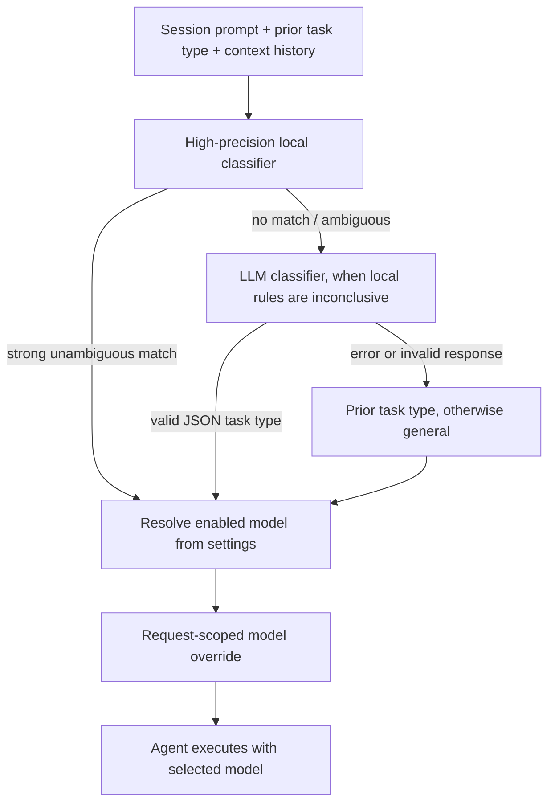

# Task Routing

English | [简体中文](zh/routing.md)

This document describes how the current runtime classifies an interactive request and turns that classification into model parameters. Routing is a model-selection step; it does not itself decide whether work is delegated to another Agent.

## The routing path

The interactive path starts in `Session.AskStream`. The session passes the new prompt, the previous task type, and its current context payload to the router. A successful decision is attached to that request's context as a model override. The Agent then uses the override for the request without changing the model configuration of unrelated requests.

## Task types are not difficulty levels

The classifier returns one of three task types:

| Type | Classification intent |
| --- | --- |
| `general` | Conversation, explanation, writing, translation, or summarization of supplied material. |
| `engineering` | Repository/code work, debugging, tests, databases, APIs, automation, deployment, or technical implementation. |
| `research` | External search, current information, source checking, comparisons, or citation-led work. |

The distinction is about the nature and source of the work, not how difficult it is or how much reasoning it needs. A local code/log investigation is engineering; seeking current external sources is research. Image presence does not create a separate task type.

## How routing evolved

SoloQueue initially explored choosing models by task difficulty. In practice, difficulty was hard to assess consistently and did not map cleanly to the right model. Routing by task type proved closer to everyday use: people tend to choose a model based on whether they are having a general conversation, doing engineering work, or researching external information. SoloQueue therefore classifies requests by task type and lets each type map to its own model.

Semantic classification still uses an LLM: local rules handle clear cases, while ambiguous requests go to the configured classifier model. We will follow JEV's progress and evaluate whether it is suitable for task classification; this remains a future consideration, not a current capability.

## Classification stages

### Local fast-track

`internal/router/fasttrack.go` is intentionally conservative. Strong signals include code blocks, stack traces, and shell/build commands. A file path is strong evidence only when paired with an engineering signal; a technical entity is paired with an action or defect signal. Explicit research or general-language patterns are also recognized.

The local classifier returns a result only when the evidence points clearly to one type. Overlapping signals and weak evidence return “not matched” so they can continue to semantic classification instead of forcing a brittle guess. The result records a source and reason code for observability.

### LLM fallback

When enabled and the local classifier does not decide, `internal/router/llm_classifier.go` sends a bounded request to the configured classifier model. It includes the current prompt, image-presence metadata, and at most six recent user/assistant messages, capped at 4,096 bytes. The classifier request uses a five-second timeout, temperature zero, a small output limit, disabled thinking, and JSON response mode.

Only a valid JSON response containing a supported task type is accepted. Provider errors, malformed JSON, or unsupported values fall back to the previous valid task type; if there is none, the result is `general`. Failures are logged with bounded response diagnostics and do not become the user-facing answer.

## Resolving a model

After classification, `internal/router/router.go` asks the configuration service to resolve the corresponding enabled model. For interactive requests, the current precedence is:

1. The model configured for the classified task type.
2. The configured fallback model.
3. The compiled task default, when enabled and available.

The classifier model has its own route, then uses the configured fallback and compiled classifier default. A reference resolves only when both its provider and model are enabled.

In `settings.yaml`, `model_routes.general`, `engineering`, and `research` map the task types to `provider:model` references. `model_routes.classifier` configures the auxiliary classifier, `fallback` is the shared configured fallback, and `vision` is a separate route for vision-model use; neither `classifier` nor `vision` is a task type.

The resulting `RouteDecision` contains the provider, API model ID, display name, thinking settings, reasoning effort/type, context-window size, and vision capability. Vision is copied as a model capability; it is not a classification criterion. The session stores the selected task type for follow-up continuity, resizes the active context window to the selected model's capacity, and publishes the chosen route with the request events.

If interactive classification or route resolution fails, the session logs the error and continues without applying an override, using the Agent's configured model. This differs from scheduled work: scheduled model resolution requires an explicitly configured task model or fallback and reports an error rather than silently using a compiled default.

## Runtime wiring and state

- `internal/runtime/build_agent.go` builds the default classifier and router from the current settings and LLM client.
- `internal/session/session.go` owns per-request classification, request-scoped model overrides, and previous-task continuity.
- Route state is kept with the live session. For persisted L2 sessions, the last task type is also merged into session metadata so a restart can retain follow-up context.
- Classifier provider/model changes can be applied through the router's update method without rebuilding the classifier abstraction.

Useful implementation and regression-test locations: [`internal/router`](../internal/router), [`internal/tasktype`](../internal/tasktype), [`internal/config`](../internal/config), and [`internal/session`](../internal/session).
