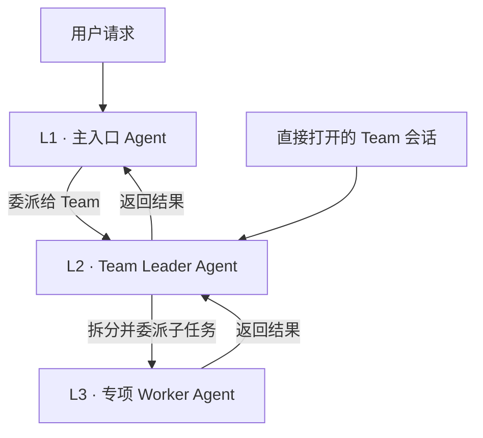
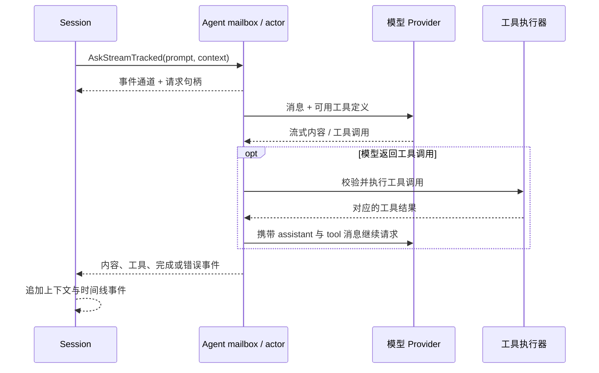

# Agent 执行

[English](../agent.md) | 简体中文

本文沿着一次请求从提交到流式完成的过程，介绍当前代码中的 Agent 执行、工具调用和任务委派方式。

## Agent 与 Session 的职责

Agent 是一个执行单元，持有已装配的 Prompt、模型客户端、工具集合和工作目录。Session 管理围绕对话的状态：活动上下文窗口、请求生命周期、取消、路由连续性和时间线持久化。Session 将工作交给 Agent；长期对话历史不由 Agent 自己持有。

## 执行层级：L1、L2 与 L3

这些名称描述执行层级，不表示任务难度，也不是路由器中的 `general` / `engineering` / `research` 任务类型。三层共用同一套 Agent 运行时；Factory 会为它们配置不同的 Prompt、工具、工作上下文和生命周期管理方式。

| 层级 | 执行职责 | 上下文与生命周期 |
| --- | --- | --- |
| **L1** | 普通用户会话的主入口 Agent。可以直接回答和使用工具，也可以将合适的任务委派给 Team Leader。 | 使用 SoloQueue 全局工作目录，以及用户会话对应的 Context/时间线。委派目标校验只允许已配置的 Team Leader。 |
| **L2** | 从 Leader 模板创建的 Team 负责人 Agent，处理该 Team 的工作并协调专项 Worker。用户也可以直接打开独立 Team 会话，不必先经过 L1 委派。 | 使用选定的项目/工作目录、Team 专属 Prompt 和工具，并由独立 Session 管理上下文与时间线。长期记忆能力绑定到该 Team。 |
| **L3** | 从 Worker 模板或动态 Worker 定义创建的专项 Agent，为 L2 执行具体子任务。 | 由 L2 的 Supervisor 创建或复用，并继承 L2 工作目录；Supervisor 跟踪和回收 Worker 实例。Worker 不会获得长期记忆工具。 |

L1 可以直接执行，也可以将请求交给已配置的 Team Leader。L2 Supervisor 会装配 Worker 委派能力，并跟踪多个子 Agent 实例，包括同一 Worker 模板的并行实例。当前 Factory 的 L2→Worker 委派是同步等待：父 Agent 收到 Worker 结果后再继续。L3 不再向下创建委派层级。

这些层级描述的是执行拓扑，不要求每个请求都经过全部层级：L1 直接处理的请求停留在 L1；用户直接发起的 Team 会话从 L2 开始。路由可以独立为各请求选择模型，但不会因此把请求从一个层级晋升到另一个层级。

## 团队组织方式

SoloQueue 最初也采用了常见的职能划分：把工程团队拆成前端、后端和测试 Agent。但在实际使用中，这种方式并不高效。具备相应能力的模型本身已经掌握多个工程领域的知识；按人的岗位重复配置 Agent，容易重复注入角色指令和上下文，增加 Token 消耗与任务交接，却没有带来相称的能力提升。

因此，SoloQueue 更倾向于围绕一个主领域组织 Team：由领域 Leader 理解任务、决定直接执行还是委派，并汇总结果；再配置少量职责清晰的执行 Agent，承担代码探索、定点修改、测试验证等具体工作。内置 Engineering Team 就采用这种方式：一个覆盖工程工作的 Leader，配合 `explorer`、`editor`、`tester` 等 Worker，而不是拆成前端、后端和测试团队。

这是一种基于实际使用的工程取舍，并不意味着所有请求都必须委派。目标是减少重复的角色提示和不必要的协调，同时保留确实能提供明确执行能力的 Worker。

## Actor 生命周期与请求归属

每个 Agent 都有 mailbox 和长期运行的工作 goroutine。提交的任务由该 Agent 串行处理，运行状态在 `Idle`、`Processing`、`Stopping` 和 `Stopped` 之间变化。支持优先级的 mailbox 可以优先处理委派任务的继续回调，而非普通用户请求。

`AskStreamTracked` 会创建请求级 job tracker 和句柄，将 Trace/Agent 元数据写入 Context 后提交任务。调用方会立即得到一个带缓冲的事件通道。Agent 在执行过程中不断产出事件，结束时关闭通道。调用方应持续读取该通道；若要中途放弃，则应先取消请求，因为通道满时会施加背压而不是丢弃事件。

Session 以自己的 Request ID 和取消生命周期关联该工作，因此能够取消或隔离准确的请求，不会误伤之后进入 mailbox 的任务。普通浏览器连接断开并不必然取消后台工作；具体取消行为由请求来源和显式取消路径决定。

## 模型与工具循环

对于由 Session 管理的请求，`AskStreamWithHistoryTracked` 会从当前 `ContextWindow` 构建每轮 Provider Payload。Agent 将上下文窗口中的消息转换为 LLM 消息类型，应用当前请求的模型覆盖，然后调用流式模型客户端。不带 Session 历史的直接 Agent 请求则为单次任务使用临时内存策略。

流式循环处理增量内容、推理内容和工具调用参数。工具调用完整后，Agent 在已注册工具集合中解析目标、执行工具、发送工具开始/结束事件，并将结果与原始 Call ID 关联。随后，assistant 工具调用消息及对应结果会作为下一轮模型请求的上下文。如果模型给出最终答复，Agent 发出完成事件；Provider、工具或取消错误则以错误/终止事件表示。

工具实现通过运行时的工具子系统注册。模型协议处理留在 `internal/agent`，具体操作则位于 `internal/agenttools`。Agent 执行 Context 还携带当前请求的模型选择、遥测、取消和运行监控元数据。

## Agent 委派

委派由工具调用实现，不是另一套独立的模型路由器。Delegate 工具会解析目标名称，可以复用同一工作目录下合适的空闲 Agent，也可以请求 Session 的 Supervisor/Agent Factory 创建子 Agent。子 Agent 继承父 Agent 的工作目录。Supervisor 按模板和实例跟踪子 Agent，供查询、停止、注销和回收。

部分委派以异步方式运行。此时父 Agent 会让出当前 Job，委派任务在后台继续。优先级 mailbox 会让继续回调先于普通新任务执行，使父 Agent 收到委派结果后恢复，同时保证上下文更新顺序。委派开始/完成使用结构化事件表示，不混入普通文本增量。

Agent 包通过 `internal/iface` 暴露少量事件和可定位对象接口，使 Session 与工具包依赖共享契约，而不是彼此耦合到具体实现。

## 事件与持久化边界

Agent 事件用于表示流式数据和控制状态，包括文本增量、推理增量、工具开始/完成、迭代完成、最终答复、错误和委派生命周期。服务器将这些事件映射为 WebSocket 协议。Session Hook 会将对话消息和工具元数据追加到时间线；系统 Prompt 会载入上下文窗口，但不会作为对话事件持久化。

实现与测试位置：[`internal/agent`](../../internal/agent)、[`internal/session`](../../internal/session)、[`internal/agenttools`](../../internal/agenttools)、[`internal/iface`](../../internal/iface)、[`internal/agent/stream_test.go`](../../internal/agent/stream_test.go)。
