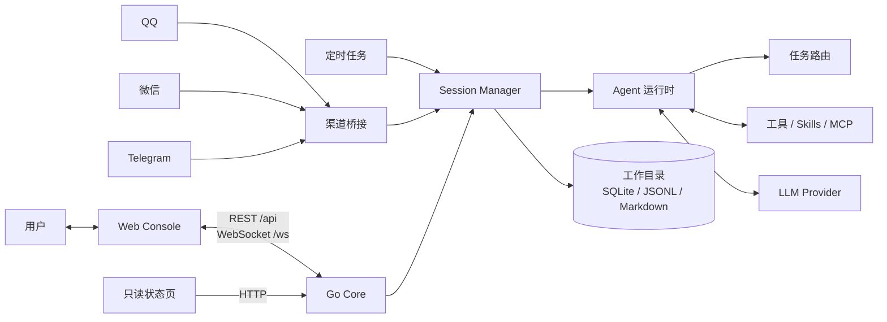
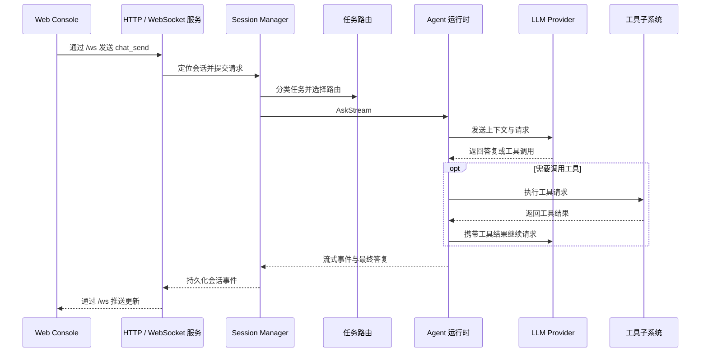

# 架构

[English](../architecture.md) | 简体中文

本文介绍 SoloQueue 当前的运行方式、组件协作关系，以及请求和数据在系统中的流转边界。

## 系统概览

SoloQueue 由负责会话、配置、工具和持久化数据的 Go **Core** 驱动。**Web Console** 是主要交互界面，可与 Core 一起运行，也可单独运行并连接本地或远程 Core。**状态页**是独立的只读视图。消息渠道和定时任务也可以通过 Core 发起工作。

浏览器只是客户端，不承载 Agent 运行时：Web Console 连接远程 Core 时，请求处理和工作目录数据都属于远程 Core。在组合运行模式下，Core 使用同一监听地址提供 Web Console 和状态页；独立 Web Console 只提供前端静态资源，并直接连接配置的后端。

## 运行与连接方式

| 方式 | 运行内容 | 适用场景 |
| --- | --- | --- |
| 组合运行 | Core、Web Console、状态页 | 通过一个地址使用完整的本地应用。 |
| Core 服务 | Core 与 API；可选提供只读状态页 | 将运行时留在一台机器或服务器上，再从浏览器连接。 |
| 独立 Web | 仅 Web Console | 打开本地前端，在**设置 → 连接**中将后端配置为本地或远程 Core。 |

Core 默认监听 `127.0.0.1`。独立 Web Console 通过 HTTP REST（`/api`）和 WebSocket（`/ws`）与 Core 通信；前端服务本身不需要通过反向代理转发请求。远程访问需要主动配置并做好保护，参见[安全边界](#安全边界)。

## 一次请求如何流转

Web Console 中主要的对话请求链路如下：

Web Console 的其他页面通过 REST 接口读写配置、会话、团队、定时任务和状态数据。QQ、微信和 Telegram 适配器会规范化外部消息；定时任务则通过同一会话与 Agent 运行时启动工作。它们的入口和结果投递方式不同，但执行阶段共享 Core。

## 组件与职责

| 组件 | 职责 |
| --- | --- |
| [`cmd/soloqueue/cli`](../../cmd/soloqueue/cli) | 进程入口和启动装配。 |
| [`internal/runtime`](../../internal/runtime) | 构建共享依赖容器 `Stack`，包括客户端、注册表、数据库和热加载监听器。 |
| [`internal/server`](../../internal/server) | REST API、WebSocket Hub、前端静态资源服务和 HTTP 边界。 |
| [`internal/session`](../../internal/session) | 创建和管理会话、上下文窗口、时间线写入器及 Agent 实例。 |
| [`internal/agent`](../../internal/agent) | 执行 Agent 循环、处理工具调用并协调委派 Agent。 |
| [`internal/router`](../../internal/router)、[`internal/llm`](../../internal/llm) | 分类任务、选择已配置路由并与模型 Provider 通信。 |
| [`internal/agenttools`](../../internal/agenttools) | 原生工具、Skills、MCP 集成和语言服务支持。 |
| [`internal/prompt`](../../internal/prompt)、[`internal/team/store`](../../internal/team/store) | 组装 Prompt，加载和持久化 Agent 与群组定义。 |
| [`internal/cron`](../../internal/cron)、[`internal/channel`](../../internal/channel) | 发起定时任务并连接外部消息平台。 |
| [`internal/memory`](../../internal/memory)、[`internal/infra`](../../internal/infra) | 上下文与记忆、时间线、共享数据库、日志、遥测和工作目录支持。 |

专题说明：[任务路由](../routing.md)、[Agent 执行](../agent.md)、[上下文与记忆](../context-and-memory.md)。

`runtime.Build` 在启动时统一装配共享服务，并将生成的 `runtime.Stack` 提供给会话构造和服务器。因此，来自浏览器、消息渠道和定时任务的请求使用同一套已配置运行时，而不是各自创建一套核心服务。

### 路由与 Agent 执行

路由器将任务分为 `general`、`engineering` 和 `research`，再映射到已配置的模型路由。明确的结构特征优先由本地规则处理；无法确定时再调用 LLM 分类器。后续对话可以沿用上一轮任务级别。

Agent 负责模型与工具之间的执行循环。模型可以直接返回答复，也可以请求调用工具；Core 执行工具后将结果交回模型，并通过所属会话向界面推送进度。原生工具、Skills 和 MCP 工具共用工具执行边界。项目目录或 Agent 工作目录决定执行上下文，但本身不是安全沙箱。

## 配置与持久化数据

Core 的工作目录默认为 `~/.soloqueue`，也可通过 `SOLOQUEUE_WORK_DIR` 修改。使用远程 Web Console 时，配置和持久化数据仍保存在 Core 所在主机；浏览器连接偏好保存在该浏览器本地。

| 路径 | 内容 |
| --- | --- |
| `settings.yaml` | Core 设置、模型路由和集成配置。 |
| `mcp.json` | 外部 MCP 服务器定义。 |
| `agents/`、`groups/` | 用于构建 Prompt 和团队的 Agent、群组定义。 |
| `skills/` | 全局安装的 Skills；项目也可在 `.claude/skills/` 提供兼容 Skill。 |
| `soloqueue.db` | 运行时子系统使用的共享 SQLite 数据。 |
| `logs/timelines/` | 追加写入的 JSONL 对话与执行历史，按团队或会话组织。 |
| `memory/` | Markdown 对话摘要和相关记忆文件。 |

这些数据各有用途：上下文窗口是当前提供给模型的输入；摘要帮助信息跨越上下文压缩；长期记忆支持检索；时间线保存可重放的会话事件。它们不能互相替代，也不构成彼此的备份。请保护完整工作目录，以及工具可能访问到的项目文件。

## 上下文与记忆

- **活跃上下文**（`internal/memory/ctxwin`）跟踪 Token 用量，并在达到配置阈值时压缩较早的历史。请求发送给 Provider 前，会过滤不完整的孤立工具调用/结果配对。
- **对话摘要**（`internal/memory/conversation`）以 Markdown 形式保存在工作目录中，帮助上下文压缩后保留关键信息。
- **长期检索**（`internal/memory/engine`）结合 SQLite FTS5/BM25 检索和知识图谱；向量检索为可选能力，需要配置 Embedding Provider。
- **时间线**（`internal/memory/timeline`）以追加式 JSONL 记录对话重放和执行历史；系统 Prompt 不写入时间线。

## 外部集成

- **Web：** REST 用于资源和设置；WebSocket 用于实时对话和运行事件。
- **消息渠道：** QQ、微信和 Telegram 适配器将平台消息转换为 Core 会话请求，并通过各平台 API 投递答复。
- **工具：** 内置工具在 Core 进程中运行；Skills 提供可复用的指令和工作流；MCP 连接配置的外部工具服务；LSP 支持作为 MCP 集成配置。
- **模型 Provider：** 由路由和 LLM 客户端层负责模型选择与通信。

## 安全边界

Core 默认仅监听回环地址，不提供应用级用户认证。不要将 Core 直接暴露到不可信网络。远程使用时，应通过正确配置了 TLS 和认证的反向代理，或 SSH 隧道限制访问，并让 Web Console 连接到受保护的 Core 地址。

工具以 Core 进程的操作系统权限运行。选择项目或工作目录只是设定工具的工作上下文，**不会**隔离文件系统或进程访问。请以最小权限运行 Core，并仅开放其确实需要访问的文件和凭据。
