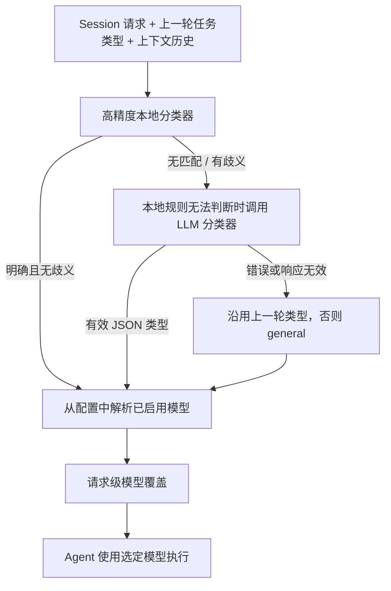

# 任务路由

[English](../routing.md) | 简体中文

本文说明当前运行时如何分类交互请求，并将分类结果转换为模型参数。路由负责选择模型，不负责决定是否把任务委派给其他 Agent。

## 路由流程

交互请求从 `Session.AskStream` 进入。Session 将新请求、上一轮任务类型和当前上下文内容交给路由器。路由成功后，模型参数以请求级覆盖写入该请求的 Context；Agent 仅对当前请求使用这个覆盖，不会修改其他请求的模型配置。

## 任务类型不等于难度级别

分类器返回以下三种任务类型之一：

| 类型 | 分类意图 |
| --- | --- |
| `general` | 日常对话、解释、写作、翻译，或总结用户提供的材料。 |
| `engineering` | 仓库与代码工作、调试、测试、数据库、API、自动化、部署或技术实现。 |
| `research` | 外部搜索、最新信息、来源核查、比较分析或需要引用来源的工作。 |

分类依据是任务性质与信息来源，不是任务难度或所需推理强度。本地查代码或日志属于 engineering；查找最新外部来源属于 research。是否包含图片也不会产生单独的任务类型。

## 路由方式的演进

早期曾尝试按任务难易程度选择模型，但实际使用中，难度往往难以稳定判断，也不容易直接对应到合适的模型。相比之下，按任务类型区分模型更贴近日常使用习惯：用户会根据任务是日常交互、工程操作还是外部调研，选择更合适的模型。因此，SoloQueue 目前按任务类型分类，并为不同类型配置对应模型。

当前语义分类仍由大模型完成：本地规则能够明确判断时会直接分类，遇到模糊请求时再调用配置的分类模型。后续会关注 JEV 模型的进展，并评估其是否适合用于任务分类；目前这仍是后续考察方向。

## 分类阶段

### 本地快速分类

`internal/router/fasttrack.go` 中的规则以谨慎为原则。代码块、Stack Trace、Shell/构建命令等属于强信号。文件路径需要与工程类信号同时出现，才构成强证据；技术实体需要与动作或缺陷信号结合。本地规则也识别明确的 research 和 general 表达。

只有证据明确指向一种类型时，本地分类器才直接返回结果。信号冲突或证据较弱时，它会返回“未匹配”，交给语义分类，而不是强行猜测。分类结果还会附带来源和原因码，供运行日志观察。

### LLM 回退

启用 LLM 分类且本地规则未能判断时，`internal/router/llm_classifier.go` 会向配置的分类模型发送有界请求。输入包括当前请求、是否包含图片的元信息，以及最多六条近期 user/assistant 消息，总计最多 4,096 字节。分类请求有五秒超时，使用零温度、较小的输出上限、关闭 thinking，并要求 JSON 响应。

只有包含受支持任务类型的有效 JSON 才会被接受。Provider 错误、JSON 格式错误或类型无效时，回退到上一轮有效任务类型；如果没有，则回退为 `general`。失败详情以有限长度写入日志，不会作为面向用户的回答输出。

## 模型解析

分类完成后，`internal/router/router.go` 调用配置服务解析对应的已启用模型。交互请求当前按以下优先级解析：

1. 为分类任务类型配置的模型。
2. 配置的 fallback 模型。
3. 已启用且可用时使用代码内置的任务默认模型。

分类器模型有独立路由，随后依次回退到配置的 fallback 和代码内置的分类器默认模型。只有 Provider 和模型都启用时，配置引用才有效。

在 `settings.yaml` 中，`model_routes.general`、`engineering` 和 `research` 分别配置任务类型对应的 `provider:model` 引用；`model_routes.classifier` 配置辅助分类器，`fallback` 是共享的显式回退模型，`vision` 则是单独的视觉模型路由。`classifier` 和 `vision` 都不是任务类型。

路由结果 `RouteDecision` 包含 Provider、实际 API 模型 ID、展示名称、thinking 设置、推理强度/类型、上下文窗口大小和视觉能力。视觉能力只是模型属性，不是分类依据。Session 会保存选中的任务类型供后续轮次沿用，将当前上下文窗口调整为该模型容量，并随请求事件发布选中的路由信息。

交互分类或模型解析失败时，Session 会记录错误并继续执行，不设置模型覆盖，改用 Agent 已配置的模型。这与定时任务不同：定时任务解析要求显式配置任务模型或 fallback，缺失时返回错误，不会静默使用代码内置默认值。

## 运行时装配与状态

- `internal/runtime/build_agent.go` 根据当前设置和 LLM 客户端构造默认分类器与路由器。
- `internal/session/session.go` 负责逐请求分类、请求级模型覆盖和上一轮任务类型连续性。
- 路由状态保存在活动 Session 中。持久化的 L2 Session 还会将最近任务类型合并写入 Session 元数据，使重启后仍能保留后续对话分类上下文。
- 分类器 Provider/模型更新可通过 Router 的更新方法应用，无须替换分类器抽象。

实现与回归测试位置：[`internal/router`](../../internal/router)、[`internal/tasktype`](../../internal/tasktype)、[`internal/config`](../../internal/config)、[`internal/session`](../../internal/session)。
