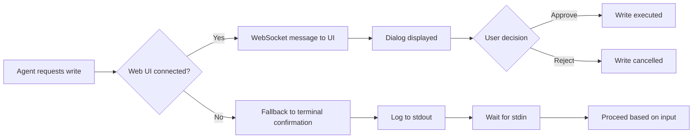
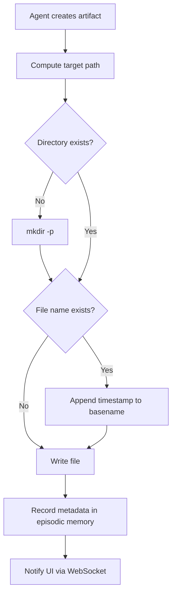

# Data Model

**Feature**: Web UI Enhancements for Agent Output & Interaction
**Date**: 2026-02-13

## Entities

### Agent Configuration
*Existing schema extended with optional `color` field.*

| Field | Type | Required | Description | Constraints |
|-------|------|----------|-------------|-------------|
| `name` | string | Yes | Unique agent identifier | Must match `[a-z][a-z0-9_]*` |
| `description` | string | Yes | Human‑readable description | Max 200 characters |
| `group` | string | Yes | Team affiliation | Must correspond to an existing group |
| `model` | string | Yes | LLM model identifier | e.g., `deepseek-reasoner` |
| `reasoning` | boolean | No | Enable reasoning mode | Default `false` |
| `is_leader` | boolean | No | Marks agent as team leader | Default `false` |
| `tools` | array of strings | No | List of enabled tool names | Each tool must be registered |
| `sub_agents` | array of strings | No | List of delegateable sub‑agent names | Each must be a valid agent |
| `color` | string | No | CSS color value for UI output blocks | Hex (`#RRGGBB`), named color (`blue`), or RGB(`rgb(...)`) |

**Notes**:
- The `color` field is optional. If absent, the UI assigns a color from a deterministic palette based on `name` hash.
- Color values are not validated beyond basic CSS syntax; invalid values are ignored (default palette used).
- Configuration is stored as Markdown files in `config/agents/<name>.md` with YAML frontmatter.

### Artifact
*File produced by an agent as a result of its work.*

| Field | Type | Description | Constraints |
|-------|------|-------------|-------------|
| `filename` | string | Original base name of the artifact | Must be a valid filename (no path separators) |
| `stored_path` | string | Full filesystem path where artifact is saved | Always under `.soloqueue/memory/<agent_id>/artifacts/` |
| `agent_id` | string | ID of the agent that created the artifact | Matches agent `name` |
| `created_at` | timestamp | ISO‑8601 timestamp of creation | Set at write time |
| `size_bytes` | integer | File size in bytes | ≥ 0 |

**Lifecycle**:
1. Agent initiates artifact creation (e.g., report generation).
2. System determines target path: `.soloqueue/memory/<agent_id>/artifacts/` (created if missing).
3. If a file with same `filename` already exists, append timestamp: `<basename>_YYYYMMDDTHHMMSS.<ext>`.
4. File is written atomically; metadata (size, timestamp) recorded in agent’s episodic memory (JSON sidecar).
5. Artifact becomes immediately accessible via web UI (file‑serve endpoint) and CLI.

### Agent Memory Directory
*Directory hierarchy for agent‑specific persistent data.*

| Path | Purpose | Auto‑created |
|------|---------|--------------|
| `.soloqueue/memory/<agent_id>/` | Root of agent’s memory storage | Yes (on first agent activation) |
| `.soloqueue/memory/<agent_id>/episodic/` | Episodic memory (task history) | Yes |
| `.soloqueue/memory/<agent_id>/semantic/` | Semantic memory (vector store) | Optional |
| `.soloqueue/memory/<agent_id>/artifacts/` | Artifact storage (this feature) | Yes (on first artifact write) |

**Constraints**:
- `<agent_id>` equals agent’s `name` field.
- Directory permissions follow umask (default `0o755`).
- All paths are relative to project root; absolute symlinks prohibited.

## Relationships

- **Agent Configuration** → **Artifact**: One‑to‑many. An agent may produce many artifacts.
- **Agent Configuration** → **Agent Memory Directory**: One‑to‑one. Each agent has exactly one memory directory.
- **Artifact** → **Agent Memory Directory**: Many‑to‑one. Each artifact resides in its agent’s `artifacts/` subdirectory.

## State Transitions

### Write‑Action Confirmation Flow

### Artifact Storage Flow

## Validation Rules

1. **Color field**: Must be a valid CSS color (regex: `^#([0-9a-fA-F]{3}|[0-9a-fA-F]{6})$|^[a-zA-Z]+$|^rgb\([^)]+\)$`). Invalid values are ignored.
2. **Artifact filename**: Must match `^[a-zA-Z0-9_.-]+$` and not contain `/` or `\`.
3. **Agent ID**: Must be an existing agent name (configuration loaded).
4. **Write‑action paths**: Must be within sandboxed workspace (validated by existing security module).